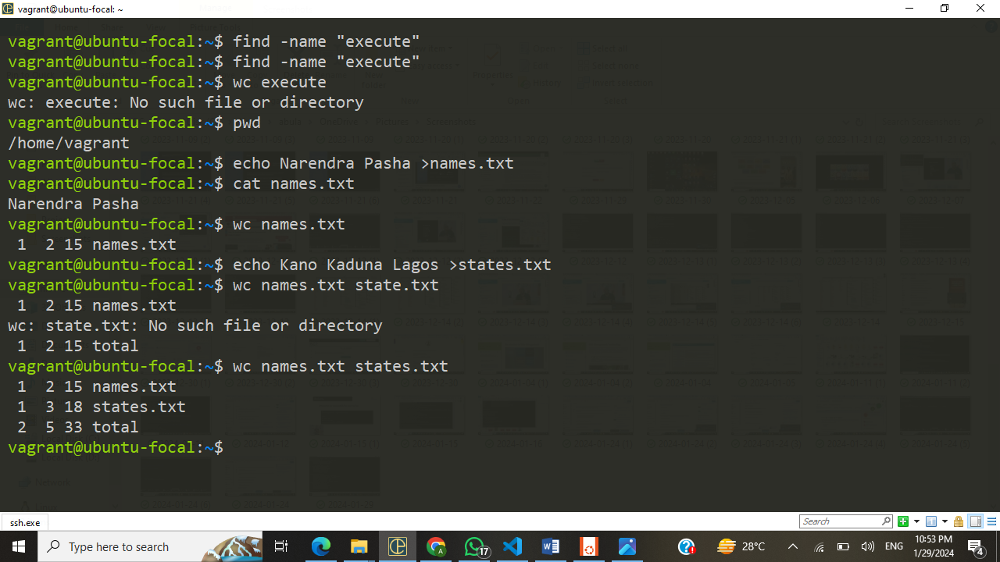
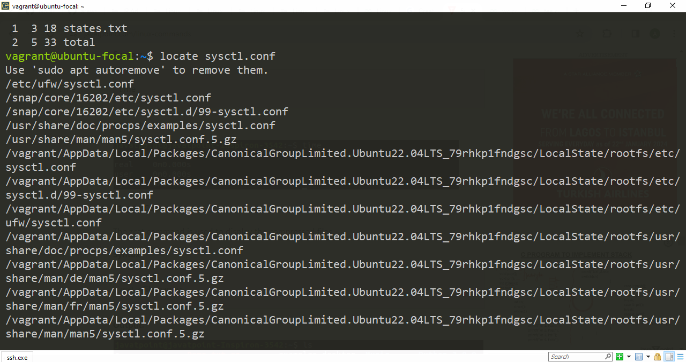
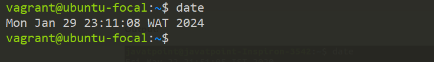
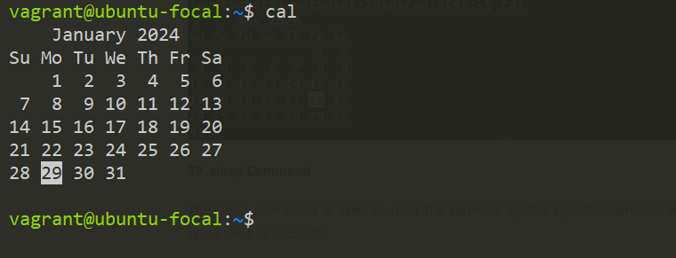
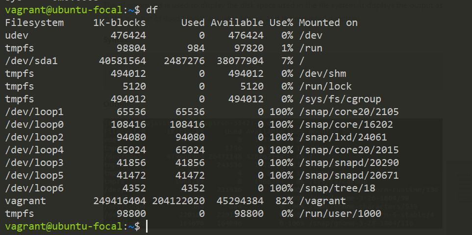
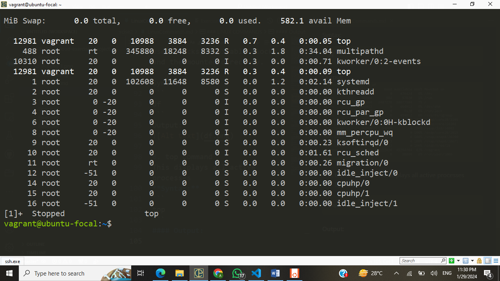
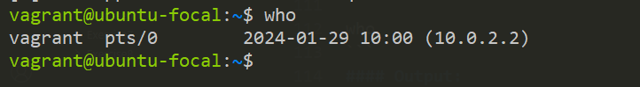
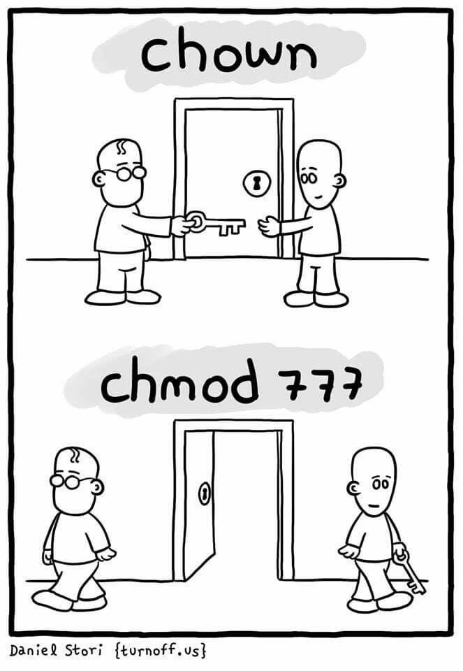

### Exercise 2

Task: Research online for 10 more linux commands aside the ones already mentioned in this module. Submit using your altschool-cloud-exercises project, explaining what each command is used for with examples of how to use each and example screenshots of using each of them.

### LINUX COMMANDS
Linux provides a powerful command-line interface compared to other operating systems such as Windows and MacOS. A lot of basic work and advanced work can be carried out through the terminal. We can do some basic tasks such as creating a file, deleting a file, moving a file, and more. In addition, we can also perform advanced tasks such as administrative tasks (including package installation, user management), networking tasks (ssh connection), security tasks, and many more.
For the sake of this exercise, we will be looking at commands that have not been used at this of the course.

1. wc
   
wc stands for word count. As the name implies, it is mainly used for counting purpose.

It is used to find out number of lines, word count, byte and characters count in the files specified in the file arguments.
By default it displays four-columnar output.
First column shows number of lines present in a file specified, second column shows number of words present in the file, third column shows number of characters present in file and fourth column itself is the file name which are given as argument.

Syntax:

```
wc [OPTION]... [FILE]...
```

Example 

```find -name "execute"```




2. Locate Command

The locate command is used to search a file by file name. It is quite similar to find command; the difference is that it is a background process. It searches the file in the database, whereas the find command searches in the file system. It is faster than the find command. To find the file with the locates command, keep your database updated.

#### Syntax:
```
locate <file name>  
```

#### Output:


3. date Command

The date command is used to display date, time, time zone, and more.

#### Syntax:

```
date
```  

#### Output:


4. cal Command

The cal command is used to display the current month's calendar with the current date highlighted.

#### Syntax:

``` 
cal
```
#### Output:


5. sleep Command

The sleep command is used to hold the terminal by the specified amount of time. By default, it takes time in seconds.

#### Syntax:
```
sleep <time>  
```
#### Output:
.png>)

6. time Command

The time command is used to display the time to execute a command.

**Syntax:**
```
time
```
.png>)

7. df Command
The df command is used to display the disk space used in the file system. It displays the output as in the number of used blocks, available blocks, and the mounted directory.

Syntax:
```
df
```  
Output:


8. top command
This displays all active processes
**Syntax:** 
```
top
```
#### Output:


9. who
The who command gives the information about the users logged on to the system.

#### Syntax:
```
who  
```
#### Output:


10. id
This command tells about your user id, primary group id, and a list of groups that belongs to you.

Syntax:
```
id
```
#### Output:



😃
