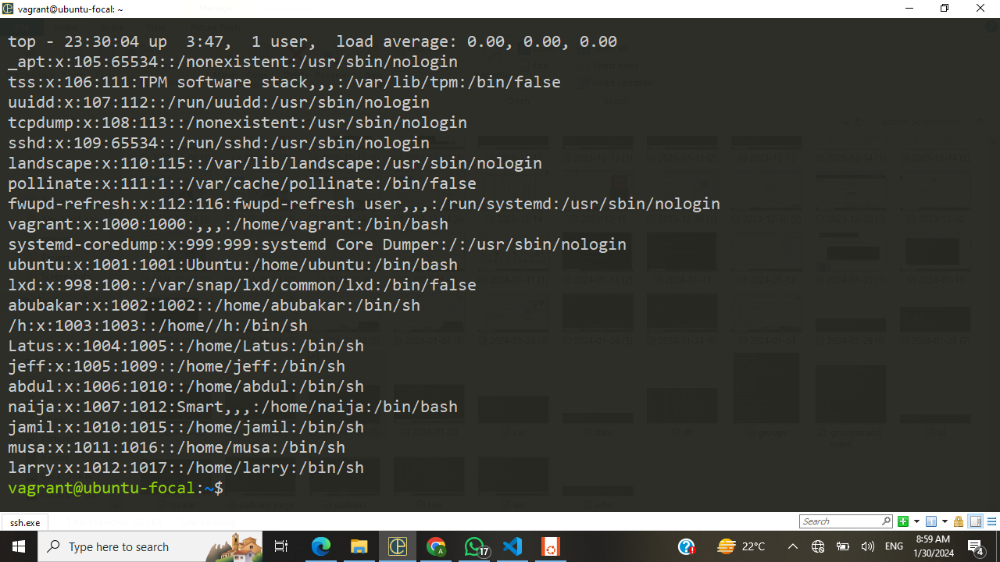

## Exercise 3

Create 3 groups – admin, support & engineering and add the admin group to sudoers. 
Create a user in each of the groups. 
Generate SSH keys for the user in the admin group.

***

### Creating Groups
I used the sudo groupadd command to add the three groups: admin, support and engineering. But while creating the 'admin' group, it was imperative for me to the name a bit as the system already had a group called 'admin'. As such the admin group was named 'admin_new'.

#### Syntax:
```
sudo groupadd admin
sudo groupadd support
sudo groupadd engineering
```
#### Content of /etc/group:


### Creating Users
To add users to the groups created above, the command 'sudo adduser' was used. 

#### Syntax:
```
sudo adduser jamil
sudo adduser larry
sudo adduser musa
```
#### Output:



### Adding Users to Groups
As required, I added one of the users created above to the admin_new, support and engineer groups.
i used the usermod -aG username group command to add the users to the group.

#### Syntax:
```
usermod -aG admin_new jamil
usermod -aG support larry
usermod -aG engineering musa
```
#### Output:
.png>)

#### Adding a Group to the Sudoer
To add the admin_new group to sudoers i used the  `visudo` command. This is used to open the sudoers file. And then the following entry will be added.

`%admin_new ALL=(ALL:ALL) ALL`

#### Output of cat /etc/sudoers:

.png>)

#### Generating SSH key for the user Jamil
To create an ssh key for the user 'jamil', I used to command `sudo su` to log in as jamil, then i used the command `ssh-keygen ` to generate the ssh.

#### Output
.png>)


Alright! 😃 Thats all the for Exercise 3. See you in the next exercise. 
*Bye* 👋.
